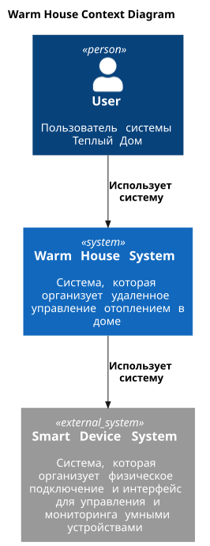
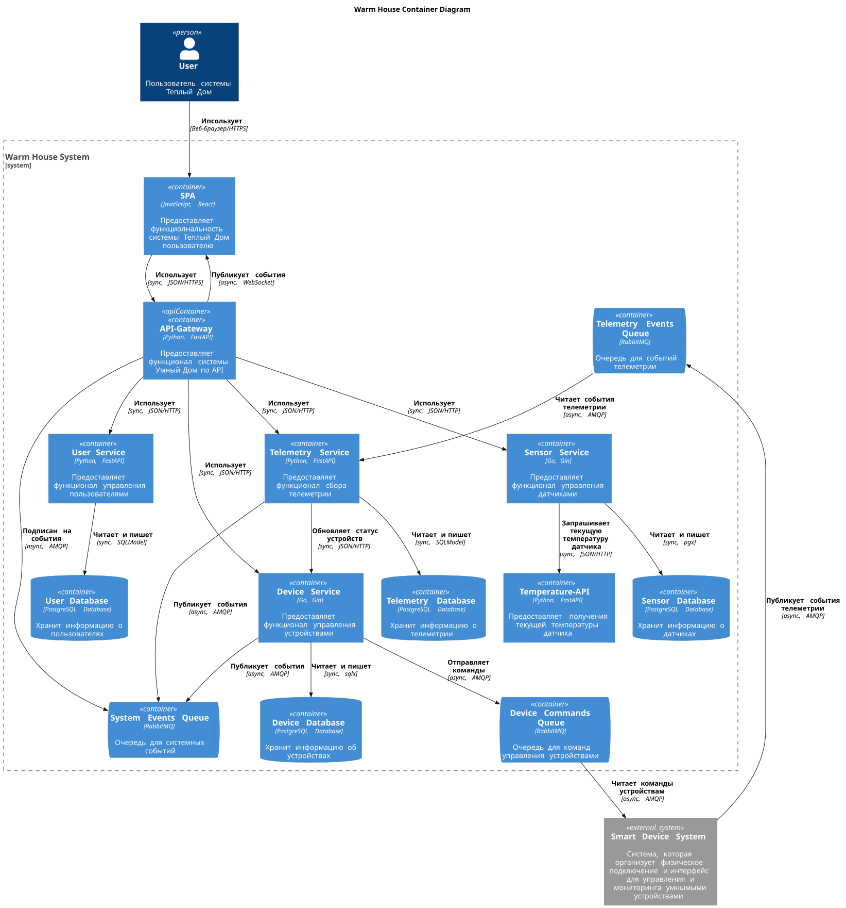
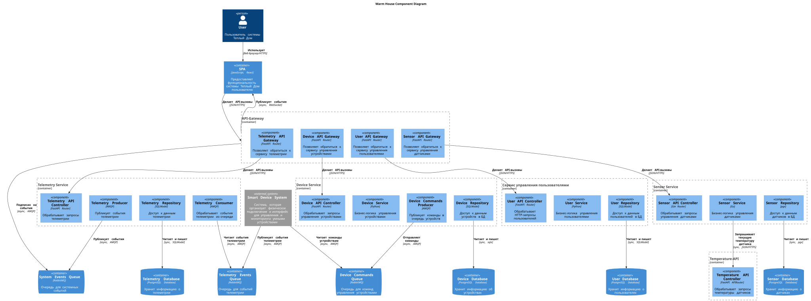
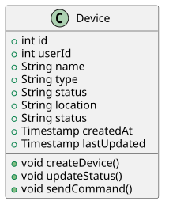
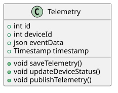
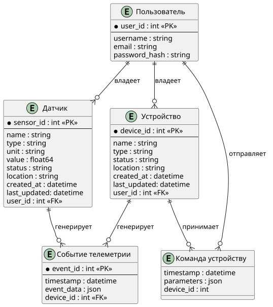

# Project_template

Это шаблон для решения проектной работы. Структура этого файла повторяет структуру заданий. Заполняйте его по мере работы над решением.

# Задание 1. Анализ и планирование

<aside>

Чтобы составить документ с описанием текущей архитектуры приложения, можно часть информации взять из описания компании и условия задания. Это нормально.

</aside

### 1. Описание функциональности монолитного приложения

**Управление отоплением:** (?)

- Пользователи могут удалённо включать/выключать отопление в своих домах.

**Мониторинг температуры:**

- Система получает данные о температуре с датчиков, установленных в домах.
- Пользователи могут просматривать текущую температуру в своих домах через веб-интерфейс. (?)

### 2. Анализ архитектуры монолитного приложения

Перечислите здесь основные особенности текущего приложения: какой язык программирования используется, какая база данных, как организовано взаимодействие между компонентами и так далее.

**Язык программирования**: `Go`

**База данных**: `PostgreSQL`

**Архитектура**: Монолитная, все компоненты системы (обработка запросов, бизнес-логика, работа с данными) находятся в рамках одного приложения.

**Взаимодействие**: Синхронное, запросы обрабатываются последовательно.

**Масштабируемость**: Ограничена, так как монолит сложно масштабировать по частям.

**Развертывание**: Требует остановки всего приложения.

### 3. Определение доменов и границы контекстов

Опишите здесь домены, которые вы выделили.

#### Анализ предметной области As-Is

Нынешнее приложение компании позволяет только управлять отоплением в доме и проверять температуру.
Каждая установка сопровождается выездом специалиста по подключению системы отопления в доме к текущей версии системы. Архитектура приложения представляет из себя монолит на Go с СУБД Postgres. Всё синхронно. Никаких асинхронных вызовов, микросервисов и реактивного взаимодействия в системе нет. Всё управление идёт от сервера к датчику. Данные о температуре также получаются через запрос от сервера к датчику. Самостоятельно подключить свой датчик к системе пользователь не может.

- Домен управления датчиками:
  - Контекст управления датчиками:
    - Сущности: `датчик`.
  - Контекст сбора телеметрии датчиков (не реализован).

- Домен управления отоплением:
  - Контекст управления отоплением (не реализован).

- Домен подключения и настройки:
  - Контекст подключение системы отопления (с участием специалиста).

#### Анализ предметной области To-Be

Для анализа предметной области To-Be решения нехватает вводных данных и понимания предметной области, поэтому были выделены предполагаемые домены и контексты для решения задачи As-Is с плавным переходом к To-Be

Экосистема доступна пользователю в режиме самообслуживания по модели SaaS.
Позволяет управлять отоплением, включать и выключать свет, запирать и отпирать автоматические ворота, удалённо наблюдать за домом, возможно и будущее неуточнённое поведение.
Пользователь самостоятельно выбирает необходимые ему модули умного дома (устройства), сам их подключает, настраивает сценарии работы и просматривает телеметрию.
Компания не занимается производством устройств, но поддерживает подключение к экосистеме устройств партнеров по стандартным протоколам.

- Домен управления пользователями:
  - Контекст управления пользователями:
    - Сущности: `пользователь`.
- Домен управления устройствами:
  - Контекст управления устройствами:
    - Сущности: `устройство`.
- Домен управления датчиками (в дальнейшем станет частью домена управления устройствами):
  - Контекст управления датчиками:
    - Сущности: `датчик`.
- Домен сбора телеметрии:
  - Контекст сбора телеметрии:
    - Сущности: `событие телеметрии`.

### **4. Проблемы монолитного решения**

1. Мало полезного функционала.
2. Решение является монолитом со всеми вытекающими последствиями:

- Высокий риск ошибок. Изменения в одной части приложения могут непредсказуемо влиять на другие части. Из-за этого возрастает вероятность возникновения ошибок и компании приходится тратить дополнительные ресурсы на тестирование.
- Длительные циклы разработки и развёртывания. При каждом изменении приходится тестировать всё приложение целиком. Это замедляет выпуск новых функций.
- Трудно управлять командой. В больших командах работа над монолитом часто приводит к конфликтам и задержкам. Изменения, которые вносит одна команда, влияют на работу других команд.
- Трудно масштабировать отдельные компоненты системы. Например, часть системы, которая отвечает за управление отоплением, испытывает высокую нагрузку. С монолитной архитектурой не получится масштабировать только эту часть — придётся масштабировать приложение целиком.

3. Только синхронное взаимодействие, что увеличивает сетевую задержку, может сделать сервис недоступным и не позволяет сделать пользовательский интерфейс более интерактивным за счет событий;
4. Пользователь не может самостоятельно подключить новое устройство.

Если вы считаете, что текущее решение не вызывает проблем, аргументируйте свою позицию.

### 5. Визуализация контекста системы — диаграмма С4

Добавьте сюда диаграмму контекста в модели C4.

[Диаграмма контекста в модели C4](./documentation/docs/docs/architecture/context.md)

<center>



</center>

Чтобы добавить ссылку в файл Readme.md, нужно использовать синтаксис Markdown. Это делают так:

```markdown
[Текст ссылки](URL)
```

Замените `Текст ссылки` текстом, который хотите использовать для ссылки. Вместо `URL` вставьте адрес, на который должна вести ссылка. Например:

```markdown
[Посетите Яндекс](https://ya.ru/)
```

# Задание 2. Проектирование микросервисной архитектуры

В этом задании вам нужно предоставить только диаграммы в модели C4. Мы не просим вас отдельно описывать получившиеся микросервисы и то, как вы определили взаимодействия между компонентами To-Be системы. Если вы правильно подготовите диаграммы C4, они и так это покажут.

**Диаграмма контейнеров (Containers)**

Добавьте диаграмму.

[Диаграмма контейнеров в модели C4](./documentation/docs/docs/architecture/container.md)

<center>



</center>

**Диаграмма компонентов (Components)**

Добавьте диаграмму для каждого из выделенных микросервисов.

[Диаграмма компонентов в модели C4](./documentation/docs/docs/architecture/component.md)

<center>



</center>

**Диаграмма кода (Code)**

Добавьте одну диаграмму или несколько.

[Диаграмма кода DeviceService в модели C4](./documentation/docs/docs/architecture/code/DeviceService.md)

<center>



</center>

[Диаграмма кода TelemetryService в модели C4](./documentation/docs/docs/architecture/code/TelemetryService.md)

<center>



</center>

# Задание 3. Разработка ER-диаграммы

Добавьте сюда ER-диаграмму. Она должна отражать ключевые сущности системы, их атрибуты и тип связей между ними.

[ER-диаграмма системы](./documentation/docs/docs/ER_diagram.md)
<center>



</center>

# Задание 4. Создание и документирование API

### 1. Тип API

Укажите, какой тип API вы будете использовать для взаимодействия микросервисов. Объясните своё решение.

Я буду использоавть комбинацию REST API и AsyncAPI:
- REST API для обеспечения предсказуемого и синхронного интерфейса для конечных пользователей.
- AsyncAPI для обеспечения слабосвязанной, асинхронной и надежной коммуникацию внутри системы.

### 2. Документация API

Здесь приложите ссылки на документацию API для микросервисов, которые вы спроектировали в первой части проектной работы. Для документирования используйте Swagger/OpenAPI или AsyncAPI.

#### Device Service API

[Device Service OpenAPI спекцификация](./documentation/docs/docs/API/openapi/device_service.yaml)
[Device Service AsyncAPI спекцификация](./documentation/docs/docs/API/asyncapi/device_service.yaml)

#### Telemetry Service API

[Telemetry Service OpenAPI спекцификация](./documentation/docs/docs/API/openapi/telemetry_service.yaml)
[Telemetry Service AsyncAPI спекцификация](./documentation/docs/docs/API/asyncapi/telemetry_service.yaml)


# Задание 5. Работа с docker и docker-compose

Перейдите в apps.

Там находится приложение-монолит для работы с датчиками температуры. В README.md описано как запустить решение.

Вам нужно:

1) сделать простое приложение temperature-api на любом удобном для вас языке программирования, которое при запросе /temperature?location= будет отдавать рандомное значение температуры.

Locations - название комнаты, sensorId - идентификатор названия комнаты

```
	// If no location is provided, use a default based on sensor ID
	if location == "" {
		switch sensorID {
		case "1":
			location = "Living Room"
		case "2":
			location = "Bedroom"
		case "3":
			location = "Kitchen"
		default:
			location = "Unknown"
		}
	}

	// If no sensor ID is provided, generate one based on location
	if sensorID == "" {
		switch location {
		case "Living Room":
			sensorID = "1"
		case "Bedroom":
			sensorID = "2"
		case "Kitchen":
			sensorID = "3"
		default:
			sensorID = "0"
		}
	}
```

2) Приложение следует упаковать в Docker и добавить в docker-compose. Порт по умолчанию должен быть 8081

3) Кроме того для smart_home приложения требуется база данных - добавьте в docker-compose файл настройки для запуска postgres с указанием скрипта инициализации ./smart_home/init.sql

Для проверки можно использовать Postman коллекцию smarthome-api.postman_collection.json и вызвать:

- Create Sensor
- Get All Sensors

Должно при каждом вызове отображаться разное значение температуры

Ревьюер будет проверять точно так же.

# **Задание 6. Разработка MVP**

Необходимо создать новые микросервисы и обеспечить их интеграции с существующим монолитом для плавного перехода к микросервисной архитектуре. 

### **Что нужно сделать**

1. Создайте новые микросервисы для управления телеметрией и устройствами (с простейшей логикой), которые будут интегрированы с существующим монолитным приложением. Каждый микросервис на своем ООП языке.
2. Обеспечьте взаимодействие между микросервисами и монолитом (при желании с помощью брокера сообщений), чтобы постепенно перенести функциональность из монолита в микросервисы. 

В результате у вас должны быть созданы Dockerfiles и docker-compose для запуска микросервисов. 