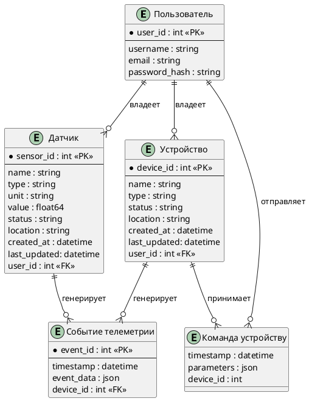

```puml
@startuml


entity "Пользователь" as user {
  * user_id : int <<PK>>
  --
  username : string
  email : string
  password_hash : string
}

entity "Устройство" as device {
  * device_id : int <<PK>>
  --
  name : string
  type : string
  status : string
  location : string
  created_at : datetime
  last_updated: datetime
  user_id : int <<FK>>
}

entity "Датчик" as sensor {
  * sensor_id : int <<PK>>
  --
  name : string
  type : string
  unit : string
  value : float64
  status : string
  location : string
  created_at : datetime
  last_updated: datetime
  user_id : int <<FK>>
}

entity "Событие телеметрии" as telemetry {
  * event_id : int <<PK>>
  --
  timestamp : datetime
  event_data : json
  device_id : int <<FK>>
}

entity "Команда устройству" as command {
  timestamp : datetime
  parameters : json
  device_id : int
}

' Связи
user ||--o{ device : "владеет"
user ||--o{ sensor : "владеет"
user ||--o{ command : "отправляет"
device ||--o{ command : "принимает"
device ||--o{ telemetry : "генерирует"
sensor ||--o{ telemetry : "генерирует"
@enduml
```
