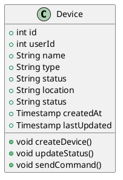

```puml
@startuml
class Device {
    +int id
    +int userId
    +String name
    +String type
    +String status
    +String location
    +String status
    +Timestamp createdAt
    +Timestamp lastUpdated
    +void createDevice()
    +void updateStatus()
    +void sendCommand()
}
@enduml
```