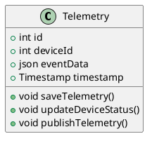

```puml
@startuml
class Telemetry {
    +int id
    +int deviceId
    +json eventData
    +Timestamp timestamp
    +void saveTelemetry()
    +void updateDeviceStatus()
    +void publishTelemetry()
}
@enduml
```